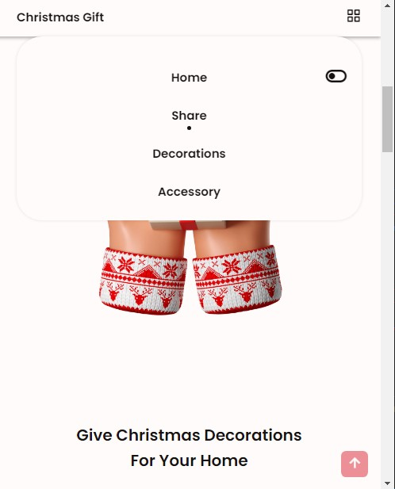

# Scroll Tracking

## Idea
Enhance navigation by automatically highlighting corresponding navigation links as their respective sections come into view during scrolling.


<br>


<br>


<br>

## Theory
The layout of a webpage consists of various sections, <br>
each positioned at specific pixels from the top of the page. <br>

For example, section-1 might start at 0px and having a height of 300px. This makes section-2 starts at 301px.

As users scroll, different sections comes into view. <br>
To consider a section as "in view", <br>
the scroll position must match the section's position and be within its height.

- `offsetHeight` provides the total height of a section in pixels.
- `offsetTop` gives the position of a section in pixels.
- `window.pageYOffset` indicates the vertical distance the scroll bar has traveled.

When the scroll position falls within the `offsetTop` and `offsetHeight` range of a particular section, the corresponding navigation link is highlighted.

## Highlighting
- The active section is determined by monitoring the scroll bar position.
- The navigation link corresponding to the active section receives the class "active-link".
- The "active-link" class is designed to display a styled dot before the link, creating a visually appealing effect.


```javascript
window.addEventListener('scroll', ()=>{
    // scroll distance
    let scrollDistance = window.scrollY;

    // for each section element, check if it is active or not
    document.querySelectorAll("section[id]").forEach((section)=>{
        let sectionTop = section.offsetTop - 50;                
        let sectionBottom = sectionTop + section.offsetHeight;
        let sectionId = section.getAttribute("id");

        if (scrollDistance >= sectionTop && scrollDistance <= sectionBottom){
            document.querySelector(`.nav__link[href*=${sectionId}]`).classList.add("active__link");
        } else {
            document.querySelector(`.nav__link[href*=${sectionId}]`).classList.remove("active__link");
        }
    })
})
```


<br><br><br><br>


# A Responsiveness Technique with Grid Layout: using auto-fit
this technique employs the "auto-fit" grid property to dynamically adjust the number of columns based on screen size, ensuring a highly responsive design without the use of breakpoints.
```css
    grid-template-columns: repeat(auto-fit, minmax(220, 1fr))
```

## Key Features

- **Dynamic Column Count**: <br>
    The layout adjusts the number of columns based on the available screen space. This provides flexibility without compromising readability.

- **Minimum Item Width**: <br>
Each grid item is allocated a minimum width of 220px, ensuring content remains easily readable and interactable.

- **Seamless Transitions**:
  - **1-Column Layout**: the container assumes 1-column layout for small screens
  - **2-Column Layout**: When the container width reaches 440px + grid-gap, a 2-column layout is initiated to make efficient use of the screen space.
  - **3-Column Layout**: As the container width increases to 660px + 2(grid-gaps), the layout smoothly transitions to a 3-column configuration.
  
- **Shared Extra Space**: <br>Between the 2-column and 3-column layouts, where the width is > 440px + grid-gap and < 660px + 2(grid-gaps), the layout remains in a 2-column format. The "1fr" unit equally distributes any extra space between the two items.

- **Optimized Layout Shifts**:
  - **1-Column Layout**: Below 440px + grid-gap, the layout transforms into a single-column arrangement, perfect for smaller screens.
  - **3-Column Layout**: Expanding to > 660px + 2(grid-gaps) and < 880px + 4(grid-gaps), the layout elegantly shifts to a 3-column layout.


```css
    .grid-container {
        display: grid;
        grid-template-columns: repeat(auto-fit, minmax(220px, 1fr));
        gap: 20px; 
    }
```


<br><br><br><br>


# Dual Theme Functionality

The **Page Dark-Light-Theme** feature allows users to easily toggle between two distinct color schemes on the page. With a simple button click, users can switch between a light theme and a dark theme, altering the colors of various page elements for improved readability and visual appeal.




<br><br>


## Key Features

- Toggle between light and dark themes with a single button click.
- Dynamically adjust the color of heading text, page body, and selected elements.
- Enhance user experience by offering improved readability and aesthetics.

## Implementation Details

To achieve this functionality, we employed the following approach:

1. **CSS Variables:** We associated specific groups of elements with CSS variables, such as `--title-color`, `--body-color`, and `--container-color`. This allowed us to centralize color definitions and streamline the process of color changes.

2. **Toggle Mechanism:** By default, these CSS variables reference colors that define the light theme. However, when the page's body element contains the class `body.dark-theme`, these variables are updated to reference colors corresponding to the dark theme.

3. **Seamless Transition:** When the user clicks the theme toggle button, we dynamically add or remove the `.dark-theme` class to/from the body element. This action triggers an instant color transformation across the page, giving users an immediate visual change.

```css
:root {
    ...  
    --first-color-send: #DE3B49;
    --text-color: #5B5757;
    --body-color: #FEFBFB;
    --title-color: #161212;
    --container-color: #FFF;
    ...
}
```

```css
body.dark__theme {
    --first-color-send: #161212;
    --text-color: #D1C7C8;
    --body-color: #251D1E;
    --title-color: #F3F1F1;
    --container-color: #302728;
}
```


<br><br><br><br>


# Scroll Reveal Animation

Enhance your website's user experience with captivating scroll animations using the ScrollReveal library.

## Implementation Steps

1. **Library Configuration**: Begin by setting up the ScrollReveal library. Define the distance and duration that will be applied to all reveal animations. Additionally, set animations to reset when items leave the viewport.

    ```javascript
    const sr = ScrollReveal({
        distance: "30px",
        duration: 1800,
        reset: true
    });
    ```

    - `distance`: Distance for the animation to travel from hidden to visible.
    - `duration`: Time taken for the animation to complete.
    - `reset`: Animation resets if elements exit and re-enter the viewport.

2. **Element Animation**: Specify how individual elements should be revealed. Animations start when elements come into view during scrolling.

    ```javascript
    sr.reveal(`.share__img`, {
        origin: "left"
    });
    ```

    - `sr.reveal()`: Trigger the animation on selected element(s).
    - `.share__img`: Class or selector of the target element.
    - `origin`: Direction from which the animation originates (e.g., "left").


<br><br><br><br>


# Back-to-Top Functionality

The back-to-top functionality enhances user experience by providing a convenient way to return to the top of the page. 

## Functionality

- **Styled Button:** The button is styled to ensure it stands out and is easy to identify.
- **Fixed Position:** The button maintains a fixed position at the bottom of the page, regardless of scrolling.
- **Visibility:** The button appears from the bottom of the page after the user has scrolled through a certain distance.
- **Link to Top:** The button is encapsulated in an `<a>` tag that serves as a hyperlink, referencing the top of the page.


## Implementation
initially, the button is positioned below the viewport via a class name "back__to__top"
```css
.back__to__top {
    ...
    position: fixed
    bottom: -20%;
    ...
}
```
once we have scrolled through a distance of 550px, we would add a class "show__back__to__top" to the button
```css
.show__back__to__top {
    bottom: 1rem;
}
```

```javascript
let BackToTopButton = document.getElementById("back-to-top");
window.addEventListener('scroll', ()=>{
    if (this.scrollY >= 550) BackToTopButton.classList.add("show__back__to__top");
    else BackToTopButton.classList.remove("show__back__to__top");
})
```


# Workflow for Christmas Landing Page Project

### Page Analysis
- Identify Colors: Determine the color palette to be used throughout the page.
- Choose Fonts: Select appropriate font names, font weights, and font sizes for text elements.
- Sectioning: Divide the page into sections based on content and layout.

### Page Navigation
- Navigation Elements:
  - Nav Logo: Include the logo in the navigation bar.
  - Nav Menu: Create a menu with links such as "Home," "Share," "Decorations," and "Accessory."
  - Nav Toggle: Implement a toggle for small screens to reveal the menu.


<br><br>


### Navigation Link Highlighting
- Scroll Interaction:
  - Highlight Links: Implement a mechanism to highlight navigation links as their corresponding sections come into view while scrolling.
  - Visual Cue: Use a dotted element or another visual indicator below the active navigation link.

### Back to Top Button
- Scroll Control:
  - Button Placement: Fix a "Back to Top" button to the bottom of the page.
  - Trigger Condition: Display the button when the user scrolls down more than 600px.
  - Smooth Scroll: Implement smooth automatic scrolling when the button is clicked.

### Page Section 1 (Home Section) - for Small Screen
- Layout:
  - Grid Layout: Use a single-column grid layout for the section.
- Elements:
  - Items: Include two items, "home-image" and "home-data."


### Page Section 2 (Share Section) - for Small Screen
- Layout:
  - Grid Layout: Employ a single-column grid layout.
- Elements:
  - Items: Consist of "share-data" and "share-image."


### Page Section 3 (Decoration Section) - for Small Screen
- Layout:
  - Responsive Grid: Utilize the "auto-fit" grid property for dynamic column count.
- Elements:
  - Auto-Fit: Set columns to adjust based on screen size and available space.


### Page Section 4 (Accessory Section) - for Small Screen
- Layout:
  - Grid Layout: Use a two-column grid layout with equal fractions of space.
- Elements:
  - Card Structure: Display five accessories in card-like containers.
  - Container Style: Implement a 1-column grid layout for card containers.
  - Content: Customize styling for "accessory-image," "accessory-name," "accessory-category," "accessory-price," and heart icon.


### Page Section 5 (Send Section) - for Small Screen
- Layout:
  - Grid Layout: Apply a 1-column grid layout.
- Elements:
  - Containers: Include "send-content" and "send-image" containers.
  - Send Content: Compose title, description, and form container.
  - Form: Use a flex layout with input and send button elements.


### Page Section 6 (Footer Section) - for Small Screen
- Layout:
  - Dynamic Columns: Implement dynamic column count using the auto-fit grid property.
- Elements:
  - Content: Include elements "christmas-gift," "our-service," "our-company," and "social."
  - List Items: Use li elements for "our-service" and "our-company."


### Page Layout for Extra-Small Screens - <359px
- Design Optimization:
  - Image Width: Resize images with specific width to have a width of 100% for better design.

### Page Layout for Medium Screens - >576px
- Layout Transformation:
  - Grid Layout: Convert 1-column layout of home, share, and send sections to a 2-column layout.
  - Equal Space: Ensure each item occupies equal space in the container.
  - Image Width: Adjust images to have a width of 100%.


<br><br>


<br><br>


<br><br>

### Page Layout for Large Screens - >768px
- Navigation Enhancement:
  - Navigation Menu: Restyle the menu into a horizontal list for improved visibility.
- Section Adjustment:
  - Accessory Section: Change the 2-column layout to a 3-column layout.
  - Padding: Add additional padding to home, share, and send sections.


### Page Layout for Extra-Large Screens - >968px
- Image and Gap Adjustment:
  - Image Width: Set images in home, share, and send sections to a width of 496px.
  - Grid Gap: Increase the grid container gap in these sections for a wider appearance.

### Page Dark-Light Theme
- Theme Toggle:
  - Color Transition: Implement a button to toggle between light and dark themes.
  - CSS Variables: Connect element colors to CSS variables for efficient global theme changes.
  - Dynamic Switch: Dynamically switch variables based on a class name on the body element.

### Page Scroll Reveal Animation
- Animation Enhancement:
  - ScrollReveal Library: Apply a drop-down animation to sections like home, accessory, decoration, and footer.


 git branch -M main
  git remote add origin https://github.com/NewmanAdesan/Christmas-E-Commerce-Website.git

